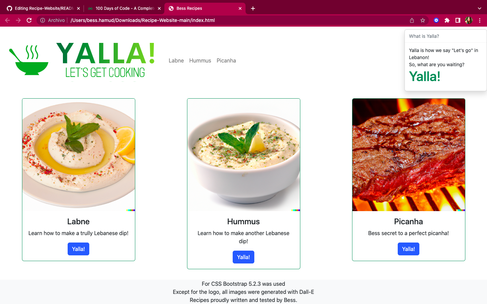

# Recipe-Website
A very fun exercise! Building a website was a good exercise to use my HTML skills, CSS skills (ended up using Bootstrap) , JS skills.

## Preview

To preview the website just go to https://htmlpreview.github.io/?https://github.com/Bess-Hub/Recipe-Website/blob/main/index.html

The cards in home.html are not being displayed by htmlpreview.github but locally it works.

I tested downloading it in .zip and running it and SUCCESS! IT WORKS.
